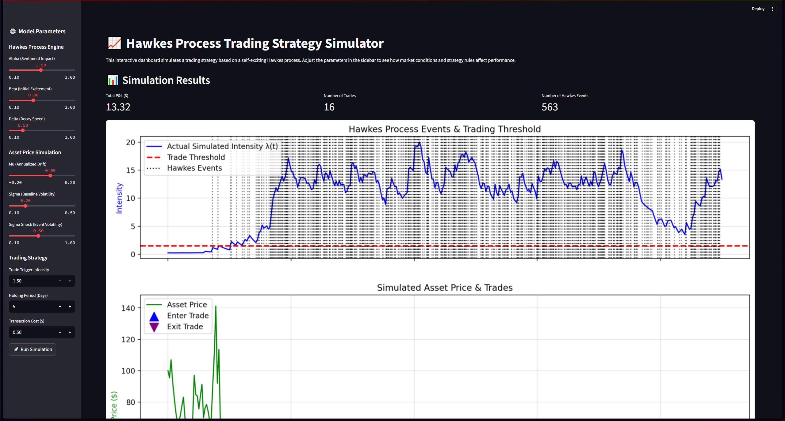

# Marked Hawkes Process Trading Simulator
Financial market simulator models how news sentiment can influence market activity and tests a volatility-based trading strategy against these dynamics. The simulation is built on a self-exciting Marked Hawkes Process, where market events are influenced by a combination of baseline volatility, historical events, and external "shocks" from financial news sentiment.The project is presented as an interactive web application built with Streamlit, allowing users to adjust all key model parameters and instantly see the impact on both market behavior and trading strategy performance.



## 🚀 Key Features
- **Interactive Dashboard:** A user-friendly interface built with Streamlit to control all simulation parameters without touching the code.
- **Sentiment-Driven Events:** Models how positive or negative news can "jolt" the intensity of market activity.
- **Self-Exciting Behavior:** Captures the real-world phenomenon of event clustering, where periods of high activity lead to more activity.
- Integrated Strategy Backtesting: Simulates a volatility-based trading strategy that acts on the events generated by the Hawkes process.
- **Dynamic Visualization:** Instantly view the results, including the simulated event intensity, asset price path, and trade entry/exit points on a clear and interactive chart.
- **Detailed Logging:** Get a summary of key performance indicators (Total P&L, Number of Trades) and a detailed log of every trade executed by the strategy.

## ⚙️ The Simulation Model: An Engine in Three Parts
The simulator's core is built from scratch in Python and integrates three distinct but interconnected processes:
1. The Event Generation Engine (Marked Hawkes Process)This process determines when market events happen. The intensity, or rate of events λ(t), is not constant; it's a dynamic function of three components:
- **Baseline Intensity:** A foundational level of activity derived from a simulated Implied Volatility (IV) curve.
  - **Self-Excitation:** Each simulated event adds a "jolt" of excitement (β), which then fades over time according to a decay speed (δ). This causes events to cluster together.
- **External Marks (Sentiment):** Impactful news events (our "marks") provide an additional, powerful jolt to the intensity. The size of this jolt is controlled by the sentiment score and the `alpha` parameter.

The simulation uses Ogata's modified thinning algorithm to generate event timestamps based on this dynamic intensity, providing a realistic event distribution.

2. The Asset Price Process (Geometric Brownian Motion)
This process simulates the price of a traded asset (e.g., a stock). The price path is modeled using Geometric Brownian Motion (GBM), but with a crucial twist: its volatility is dynamic.
- The price has a baseline drift (`mu`) and volatility (`sigma_base`).
- Crucially, for a short period following a Hawkes event, the asset's volatility is increased by a `sigma_shock_addon`. This links the event simulation to the price simulation, causing periods of high event activity to correspond with wilder price swings.

3. The Trading Strategy Process
This is the "brain" that decides when to act. It continuously monitors the output from the Hawkes process and executes a pre-defined volatility trading strategy:
- **Trigger:** A trade is initiated only when a Hawkes event occurs and the event's intensity (λ(t)) is above a user-defined `trade_threshold`.
- **Action:** The strategy enters a position, betting on a large price move (direction-neutral).
- **Lifecycle:** The trade is held for a fixed `holding_period` before being closed. Profit & Loss is calculated based on the absolute price change, minus a `transaction_cost`.

# Marked Hawkes Process Simulation with Thinning Algorithm
Python implementation for simulating a marked Hawkes process using Ogata's thinning algorithm. The simulation is contextualized for a financial application where event intensity is influenced by market volatility (proxied by option greeks) and events are "marked" with a sentiment score.

The primary goal of this project is to demonstrate an efficient and statistically sound method for simulating complex point processes and to provide tools for benchmarking its performance against a simpler, brute-force approach.

## 🚀 Features
- Marked Hawkes Process Simulation: Simulates a self-exciting point process where each event has an associated continuous value (a "mark").
- **Efficient Thinning Algorithm:** Implements Ogata's thinning algorithm, which uses a majorizing (upper-bound) intensity function to efficiently generate events, avoiding computationally expensive calculations at every time step.
- **Complex Intensity Function:** The event intensity is modeled with a realistic complexity, incorporating not just self-excitation from past events but also an exogenous signal representing the "density" of an option greeks covariance matrix.
- **Complex Mark Distribution:** Event marks are drawn from a bimodal distribution, simulating a complex sentiment score density with both positive and negative clusters.
- **Performance Benchmarking:** Includes a direct, non-thinned simulation method as a baseline to quantitatively measure the speedup achieved by the thinning algorithm.
- **Statistical Validation:** Uses the Kolmogorov-Smirnov (K-S) goodness-of-fit test to validate that the thinning algorithm correctly simulates the underlying point process.
- **Clear Visualization:** Generates a plot of the final accepted events, with the sentiment marks visualized using a color scale.

## ⚙️ How It Works
The simulation is based on the concept of a nonhomogeneous Poisson process, where the rate of events changes over time. The Hawkes process is a special case where the rate is self-exciting, meaning each event temporarily increases the probability of future events.

1. The Thinning Algorithm (Efficient Method)
This is the core of the project, based on Ogata's algorithm. Instead of checking for an event at every tiny time step, it works as follows:
  1. **Majorize:** Define a simple, piecewise-constant intensity function `lambda_bar(t)` that is always greater than or equal to the true, complex intensity `lambda(t)`.
  2. **Generate:** Propose a potential next event time by drawing from an exponential distribution with a rate of `lambda_bar`. This is computationally cheap and allows the simulation to "jump" forward in time.
  3. **Thin (Accept/Reject):** At the proposed event time `t_i`, calculate the true intensity `lambda(t_i)`. The proposed event is "accepted" with probability `lambda(t_i) / lambda_bar`. Otherwise, it is rejected, and the simulation proceeds from `t_i` to generate the next potential event.
  4. **Mark:** If an event is accepted, a "mark" is generated for it by sampling from the sentiment score distribution.

This process is significantly more efficient because the expensive lambda(t) calculation is only performed for a few potential events, not continuously.

2. Direct Simulation (Baseline Method)
For comparison, a direct simulation is also implemented:
  1. The simulation time is discretized into very small steps `dt`.
  2. At each step, the true intensity `lambda(t)` is calculated.
  3. The probability of an event occurring in that small interval is `lambda(t) * dt`.
  4. A random number is drawn to determine if an event occurs in the interval.

This method is computationally expensive and slow, serving as a baseline to demonstrate the efficiency gains of the thinning algorithm.

## 📄 Code Structure
The Python script is organized into several key functions:
- `calculate_true_intensity(...):` Computes the "true," computationally expensive intensity lambda(t). This is where the model for option greeks and self-excitation is defined.
- `calculate_majorizing_intensity(...):` Computes the simpler, piecewise-constant upper-bound intensity lambda_bar(t).
- `get_mark():` Samples a mark from the bimodal sentiment score distribution.
- `simulate_marked_hawkes_thinning(...):` The main function for the efficient thinning simulation.simulate_marked_hawkes_direct(...): The main function for the slow, baseline simulation.
- `run_kolmogorov_smirnov_test(...):` Performs the K-S test for statistical validation.
- The `if __name__ == "__main__":` block executes the simulations, times them, prints the performance and validation results, and generates the final plot.

## 📈 Expected Output
When you run the script, you will see the following in your console:
1. Performance Benchmark: Timings for both the thinning and direct simulations, along with the calculated speedup factor.
```
--- Performance and Efficiency Benchmarking ---
Running efficient thinning-based simulation...
Thinning simulation finished in 0.0123 seconds.

Running direct baseline simulation (this may be slow)...
Direct simulation finished in 2.5432 seconds.

Speedup: The thinning algorithm was 206.76 times faster than the direct simulation.
```
2. Correctness Validation: The results of the Kolmogorov-Smirnov test, indicating whether the simulation is statistically sound.
```
--- Correctness and Fidelity Validation ---
Kolmogorov-Smirnov Test Results:
  - K-S Statistic: 0.0754
  - p-value: 0.5381
  - Conclusion: At 5.0% significance level, we cannot reject the null hypothesis.
    The distribution of potential inter-arrival times is consistent with the theoretical exponential distribution.
```
3. **Visualization:** A plot will be displayed showing the times of the accepted events, with the magnitude and sign of the sentiment mark indicated by the color and size of the points on the timeline.


